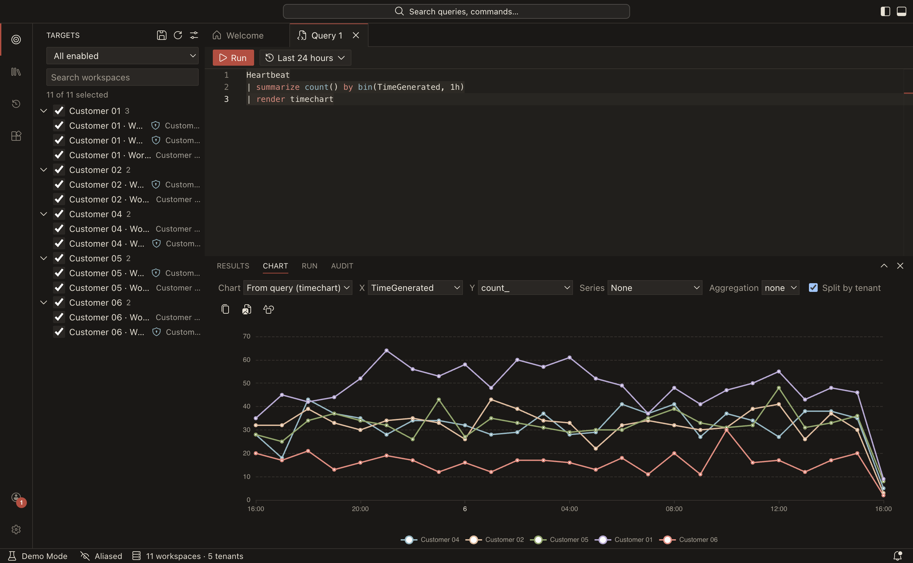
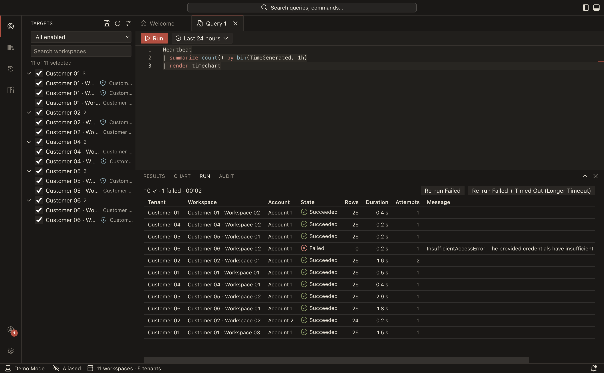
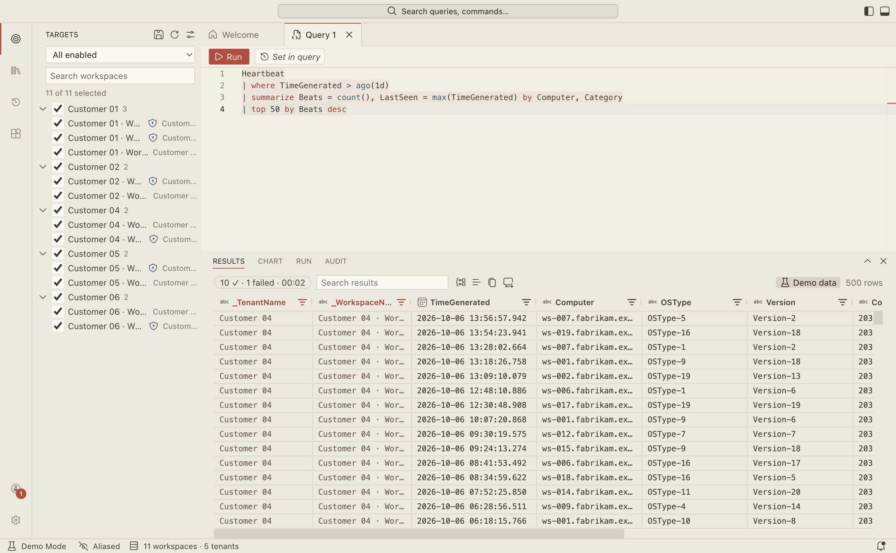

# Raml KQL

**Run one KQL query against many Azure Log Analytics workspaces at once, across many Entra tenants and many signed-in accounts, and get one merged result with the tenant and workspace on every row.**

Raml KQL is an open-source desktop app for macOS, Windows and Linux. It looks and feels like VS Code, so it is familiar from the first second. It is made for analysts who work across several customer tenants and need to ask the same question of all of them, without a Microsoft Defender multi-tenant organization (MTO).


> **Status: version 1.0.** The macOS app is signed and notarized by Apple. The Windows installer is not signed yet, so SmartScreen will warn you the first time ([details](#install)). Please [open an issue](../../issues) if something is off.

## What it does

- **One query, many workspaces.** Pick workspaces and tenant groups in the Targets view, press <kbd>Shift</kbd>+<kbd>Enter</kbd>, and watch results arrive as each workspace finishes. Slow, throttled or failing workspaces are retried, reported one by one, and never hide the ones that worked.
- **Many accounts, many tenants.** Sign in with several Microsoft accounts. Workspaces come from Azure Lighthouse delegations and guest access, found automatically with Azure Resource Graph. A workspace reachable through two accounts shows up once.
- **Attribution on every row.** Each row carries `_TenantName`, `_WorkspaceName` and the rest of the identity of where it came from, so you can group, filter and chart by customer.
- **A real KQL editor.** The Monaco editor with the Kusto language service: schema-aware IntelliSense merged across the selected workspaces (with "available in 3/5 selected" hints), formatting, snippets, parse checks before anything is sent.
- **Results you can work with.** A fast grid (half a million rows scroll smoothly), group by tenant, `render` charts and a chart builder, and export to CSV, JSON, XLSX, Markdown or a KQL `datatable`. Right-click a cell to open the query in the Azure portal or an entity in Microsoft Defender.
- **Query packs.** Share and reuse queries with parameters, from git repositories or files. An example pack ships in [`examples/packs`](examples/packs).
- **Extensions, with least privilege.** Sandboxed extensions can add enrichers (the VirusTotal example), result renderers (the Country Map example), themes and more. Each permission is asked for, and can be revoked.
- **Built for customer data.** Tenant and workspace names are aliased on screen by default ("Customer 01"), which makes screen sharing and screenshots safe. A hash-chained audit log records what ran where, without result values.

|                                                                            |                                                                                        |
| -------------------------------------------------------------------------- | -------------------------------------------------------------------------------------- |
|  |  |
| `render` charts and a chart builder, one line per tenant                   | Every workspace has a state, row count, duration and error message                     |

A light theme ships too, and the VS Code themes are built in:



## How it compares to multi-tenant advanced hunting

Microsoft Defender's multi-tenant advanced hunting is the first-party answer, and if your organization has set up a multi-tenant organization (MTO), use it. Raml KQL is for the case where you don't have one.

|                 | Defender multi-tenant advanced hunting     | Raml KQL                                                     |
| --------------- | ------------------------------------------ | ------------------------------------------------------------ |
| Requires        | A Defender multi-tenant organization (MTO) | Your own access to the workspaces (Lighthouse or guest)      |
| Data it queries | Defender XDR advanced hunting tables       | Azure Log Analytics workspaces, including Microsoft Sentinel |
| Time column     | `Timestamp`                                | `TimeGenerated`                                              |
| Where it runs   | The Defender portal                        | A desktop app, with your identity, on your machine           |
| Cost            | Part of the Defender licensing             | Free and open source                                         |

Raml KQL only ever does what you are allowed to do: it uses your delegated permissions and holds no secrets or service principals. It is a tool for your toolbelt, not a replacement for either product.

## Install

Download the installer for your system from the [latest release](../../releases/latest).

| System  | File                                                                         | First start                                                                                                               |
| ------- | ---------------------------------------------------------------------------- | ------------------------------------------------------------------------------------------------------------------------- |
| macOS   | `Raml-KQL-<version>-mac-arm64.dmg` (Apple Silicon) or `-mac-x64.dmg` (Intel) | Open the dmg and drag the app to Applications. It is signed and notarized, so macOS opens it without a warning.           |
| Windows | `Raml-KQL-<version>-win-x64.exe` (or `-arm64`)                               | Run the installer. If SmartScreen appears, choose **More info → Run anyway**. Installs per user, no administrator needed. |
| Linux   | `.AppImage`, `.deb` or `.rpm`                                                | AppImage: `chmod +x` it and run it (it updates itself). deb/rpm: install with your package manager.                       |

**Windows and SmartScreen.** The Windows installer is not code-signed yet (free signing for open-source projects is being set up), so SmartScreen doesn't know the publisher. Each release has a `SHA256SUMS` file: check your download against it (`shasum -a 256 -c SHA256SUMS --ignore-missing`, or `Get-FileHash` on Windows).

**Updates.** The app checks GitHub Releases for new versions and offers "Restart to Update". Turn it off with the setting `update.checkAutomatically`, or choose the `beta` channel with `update.channel`.

## First steps

1. **Add an account.** Open the Accounts menu (bottom of the activity bar) → **Add Account**. Your browser opens for the Microsoft sign-in. Add more accounts the same way.
2. **Look at Targets.** Your workspaces appear, grouped by tenant. Disable the ones you never query in **Workspaces settings**, and make groups for the sets you use together.
3. **Write and run.** Press <kbd>Ctrl/Cmd</kbd>+<kbd>N</kbd> for a new query, pick a time range, and press <kbd>Shift</kbd>+<kbd>Enter</kbd>.

No Azure access at hand? Start in demo mode with fake accounts, tenants, workspaces and data: `pnpm dev:demo` (see [Development](#development)), or run **Restart in Demo Mode** from the Command Palette (<kbd>F1</kbd>) in an installed app.

You need at least the **Log Analytics Reader** role (or `Microsoft.OperationalInsights/workspaces/query/read`) on each workspace you want to query. Some organizations require an administrator to approve the app first; see the [consent notes](docs/guides/entra-app-registration.md#how-consent-works-for-other-users). You can also sign in with the Azure CLI, or register your own app with [these steps](docs/guides/entra-app-registration.md).

## Privacy

- **No telemetry.** Raml KQL does not collect usage data, analytics, feature counters or identifiers.
- Your queries go from your machine straight to Microsoft, with your own identity. No Raml KQL server is involved.
- Results stay in memory, or in an encrypted session cache that is destroyed when the app closes. They are never written to disk in the clear.
- The only network traffic the app itself starts goes to the Microsoft identity and Azure endpoints you query, to git hosts of sources you added, and to GitHub for the update check (which you can turn off).
- Extensions can reach the network only after you allow it.
- Check it yourself: **Developer: Show Network Activity** lists every host contacted in this session.
- Crash reports are never sent automatically. After a crash, the app shows you a sanitized report and you decide whether to file it on GitHub.

More in [`SECURITY.md`](SECURITY.md). To report a vulnerability, use the repository's **Security** tab (private reporting).

## Documentation

- [Writing extensions](docs/guides/writing-extensions.md) and the [example extensions](examples/extensions)
- [Writing query packs](docs/guides/query-packs.md) and the [example pack](examples/packs)
- [Registering your own Entra app](docs/guides/entra-app-registration.md)
- [Testing and CI, explained](docs/guides/testing-and-ci-explained.md)
- [Design specs](docs/spec) and the [decision log](docs/DECISIONS.md)

## Development

Requirements: Node.js 24 (see `.nvmrc`) and pnpm 11 (`corepack enable` picks the right version).

```bash
pnpm install
pnpm dev:demo      # run the app with fake data, no Azure access needed
```

| Command                      | What it does                                             |
| ---------------------------- | -------------------------------------------------------- |
| `pnpm dev` / `pnpm dev:demo` | Run the app (live / demo mode) with hot reload           |
| `pnpm lint` / `pnpm format`  | ESLint + Prettier check / fix formatting                 |
| `pnpm typecheck`             | TypeScript across all workspaces                         |
| `pnpm test`                  | Unit and integration tests (Vitest)                      |
| `pnpm test:e2e`              | Build, then drive the real app in demo mode (Playwright) |
| `pnpm build` / `pnpm dist`   | Production build / installers for the current OS         |

Contributions are welcome: please read [`CONTRIBUTING.md`](CONTRIBUTING.md) first.

## Licence

[MIT](LICENSE). Third-party components: [`THIRD_PARTY_NOTICES.md`](THIRD_PARTY_NOTICES.md).
Raml KQL is not affiliated with, endorsed by or sponsored by Microsoft. "Microsoft", "Azure", "Defender", "Sentinel" and "Visual Studio Code" are trademarks of Microsoft.
