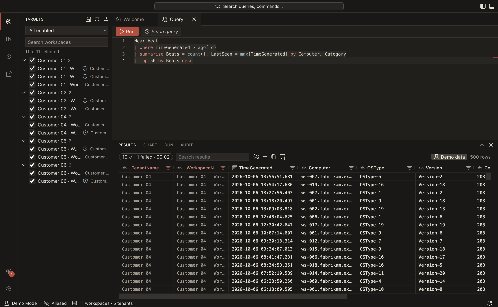

# Raml KQL documentation

Raml KQL is a free, open-source desktop app for macOS, Windows and Linux. It runs **one KQL query against many Azure Log Analytics workspaces at once**, across many Entra tenants and many signed-in accounts, and returns **one merged result** with the tenant and workspace on every row. It looks and feels like VS Code.

## Start here

- [Getting started](getting-started.md): install the app, sign in, run your first query, or try everything in demo mode without Azure access.

## Using Raml KQL

| Guide                                                           | What you learn                                                                   |
| --------------------------------------------------------------- | -------------------------------------------------------------------------------- |
| [Accounts and tenants](user-guide/accounts.md)                  | Signing in with several accounts, Lighthouse and guest access, re-authentication |
| [Workspaces and targets](user-guide/workspaces-and-targets.md)  | How workspaces are found, choosing what a query runs on, groups, aliased names   |
| [Writing and running queries](user-guide/running-queries.md)    | The editor, IntelliSense, the time range, what happens when workspaces fail      |
| [Working with results](user-guide/results.md)                   | The grid, group by tenant, charts, export, links to the portal and Defender      |
| [Saved queries, history and packs](user-guide/query-library.md) | My Queries, history, and shared query packs                                      |
| [Using extensions](user-guide/extensions.md)                    | Installing extensions and what their permissions mean                            |
| [Privacy and security](user-guide/privacy-and-security.md)      | What stays on your machine, the audit log, crash reports                         |
| [Troubleshooting](user-guide/troubleshooting.md)                | Sign-in problems, missing workspaces, platform notes                             |

## Reference

- [Settings reference](reference/settings.md): every setting with its type and default.
- [Keyboard shortcuts](reference/keyboard-shortcuts.md)
- [Configuration folder and files](reference/config-files.md): `settings.jsonc`, `keybindings.jsonc` and friends.

## Extending and administering

- [Writing extensions](guides/writing-extensions.md) and [writing query packs](guides/writing-query-packs.md)
- [Registering your own Entra app](guides/register-your-own-entra-app.md) for organizations that don't allow third-party app consent

## Contributing

- [Contributing guide](https://github.com/luca-ramseyer/raml-kql/blob/main/CONTRIBUTING.md) and [architecture overview](contributing/architecture.md)
- [Testing and CI](contributing/testing-and-ci.md) and [releasing](contributing/releasing.md)
- [Design documents](design/index.md): the detailed specifications and the decision log.

Raml KQL is MIT-licensed and not affiliated with, endorsed by or sponsored by Microsoft. Source code, releases and issues are on [GitHub](https://github.com/luca-ramseyer/raml-kql).
